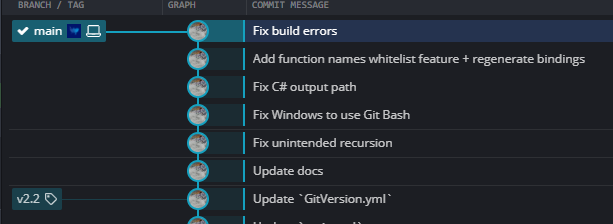

# Software Releases

Documentation on software releases at Bottlenose Labs Inc.

## Creating a release

1. Create a commit on the main branch either via completing a pull request or via a direct push. This commit will be the release candidate.

  

2. Wait for the continuous integeration (CI) and continuous delivery (CD) automated workflows to finish with everything green for the candidate release commit. If CI/CD failed, that needs to be fixed with a new commit. See [DEVOPS.md](./../devops/README.md) for more details on CI/CD.

  

3. Check that the NuGet package is pushed to the MyGet gallery with the automatic version (before release).

  

4. Create a Git tag at the release candidate commit with prefix `v` with the bumped version that follows semantic versioning. See [VERSIONING](./../versioning/README.md) for more details on semantic versioning.

  

5. Push the Git tag itself; do not push a different commit. Wait for the continuous integeration (CI) and continuous delivery (CD) automated workflows for the Git tag push to go green.

  

6. Check that the NuGet package is pushed to the MyGet and the NuGet gallery. If it's not, check the continuous integeration (CI) and continuous delivery (CD) automated workflows logs to troubleshoot.

MyGet: https://www.myget.org/feed/bottlenoselabs/package/nuget/bottlenoselabs.C2CS

  

NuGet:  https://www.nuget.org/packages/bottlenoselabs.C2CS/

  

