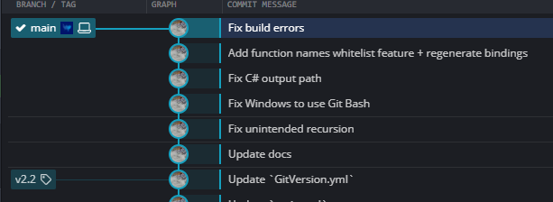

# Software: Releases

Documentation on software releases at Bottlenose Labs Inc.

## Prerequisites

1. Setup [GitVersion](https://github.com/GitTools/GitVersion) for the respository if not done already. Use the following `GitVersion.yml`.

```yml
mode: ContinuousDeployment
continuous-delivery-fallback-tag: '' # This value by default is `ci`. Make sure the NuGet pre-release name is `MAJOR.MINOR.PATCH-COMMITNUMBER`; otherwise, by default it would something like the following `1.0.0-ci001`.
assembly-versioning-scheme: None # With the newer SDK style projects in .NET, preference is to pass the version during `dotnet build` explicitly as a property parameter
```

2. Setup a GitHub action workflow `main.yml` (can be named differently but must have `.yml` extension). Assumes the main branch is `main` on GitHub. Assumes the secret `MYGET_ACCESS_TOKEN` and `NUGET_ACCESS_TOKEN` are setup in GitHub. Assumes GitHub Actions are enabled for the repository. Place the `.yml` file in repository under `.github/workflows/`.

See [PIPELINES.md](./..//pipelines/README.md) for more details on CI/CD using GitHub Actions.

```yml
on:
  push:
    tags:
      - v*
    branches:
      - main
    paths-ignore:
      - "**.md"

jobs:
  dotnet-job:
    runs-on: ubuntu-latest
    name: ".NET"
    steps:
      - uses: bottlenoselabs/github-actions-dotnet@v2
        with:
          solution-or-project: '/path/to/project.csproj'
          myget-access-token: '${{ secrets.MYGET_ACCESS_TOKEN }}'
          nuget-access-token: '${{ secrets.NUGET_ACCESS_TOKEN }}'
          is-enabled-pack: 'true'
          upload-nuget-org: "${{ startsWith(github.ref, 'refs/tags/v') }}"
          upload-myget-org: "${{ github.event_name == 'push' || startsWith(github.ref, 'refs/tags/v') }}"
```

## Creating a release

1. Create a commit on the main branch either via completing a pull request or via a direct push. This commit will be the release candidate.

<p align="center">
  
</p>

2. Wait for the continuous integeration (CI) and continuous delivery (CD) automated workflows to finish with everything green for the candidate release commit. If CI/CD failed, that needs to be fixed with a new commit. See [PIPELINES.md](./..//pipelines/README.md) for more details on CI/CD using GitHub Actions.

<p align="center">
  
</p>

3. Check that the NuGet package is pushed to the MyGet gallery with the automatic version (before release).

<p align="center">
  
</p>

4. Create a Git tag at the release candidate commit with prefix `v` with the bumped version that follows semantic versioning. See [VERSIONING](./../versioning/README.md) for more details on semantic versioning.

<p align="center">
  
</p>

5. Push the Git tag itself; do not push a different commit. Wait for the continuous integeration (CI) and continuous delivery (CD) automated workflows for the Git tag push to go green.

<p align="center">
  
</p>

6. Check that the NuGet package is pushed to the MyGet and the NuGet gallery. If it's not, check the continuous integeration (CI) and continuous delivery (CD) automated workflows logs to troubleshoot.

MyGet: https://www.myget.org/feed/bottlenoselabs/package/nuget/bottlenoselabs.C2CS
<p align="center">
  
</p>

NuGet:  https://www.nuget.org/packages/bottlenoselabs.C2CS/
<p align="center">
  
</p>